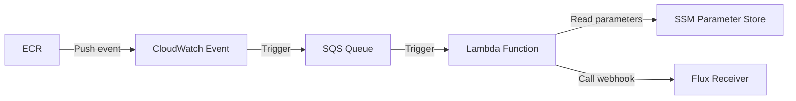

# flux2-ecr-webhook
This project allows you to automate the process of calling the Flux webhook (Receiver) when a `PUSH` action is performed in ECR, which can be useful for automating application deployment.
It is designed to be used as a Terraform module to configure an AWS Lambda function that fires when a `PUSH` action is performed on an ECR repository.
The Lambda function reads the necessary parameters from the SSM parameter store and then calls the Flux webhook ([Receiver](https://fluxcd.io/flux/components/notification/receiver/)).

The configuration includes creating an SQS queue and a CloudWatch event to trigger the Lambda function when a PUSH action is performed in ECR.

## TODO
- Add unit tests
- Add support for [generic-hmac](https://fluxcd.io/flux/components/notification/receiver/#generic-hmac)
- Add support to lambda with VPC (for internal webhook)
- Add support to multiple webhooks

## Requirements

No requirements.

## Providers

| Name | Version |
|------|---------|
|  [aws](#provider\_aws) | n/a |

## Modules

| Name | Source | Version |
|------|--------|---------|
|  [lambda\_function](#module\_lambda\_function) | github.com/terraform-aws-modules/terraform-aws-lambda | v4.16.0 |
|  [sqs\_queue](#module\_sqs\_queue) | github.com/terraform-aws-modules/terraform-aws-sqs | v4.0.1 |

## Resources

| Name | Type |
|------|------|
| [aws_cloudwatch_event_rule.ecr_event](https://registry.terraform.io/providers/hashicorp/aws/latest/docs/resources/cloudwatch_event_rule) | resource |
| [aws_cloudwatch_event_target.sqs_target](https://registry.terraform.io/providers/hashicorp/aws/latest/docs/resources/cloudwatch_event_target) | resource |
| [aws_iam_policy.lambda_secrets_policy](https://registry.terraform.io/providers/hashicorp/aws/latest/docs/resources/iam_policy) | resource |
| [aws_iam_policy.lambda_sqs_policy](https://registry.terraform.io/providers/hashicorp/aws/latest/docs/resources/iam_policy) | resource |
| [aws_iam_role_policy_attachment.lambda_secrets_attachment](https://registry.terraform.io/providers/hashicorp/aws/latest/docs/resources/iam_role_policy_attachment) | resource |
| [aws_iam_role_policy_attachment.lambda_sqs_attachment](https://registry.terraform.io/providers/hashicorp/aws/latest/docs/resources/iam_role_policy_attachment) | resource |
| [aws_lambda_event_source_mapping.sqs_mapping](https://registry.terraform.io/providers/hashicorp/aws/latest/docs/resources/lambda_event_source_mapping) | resource |
| [aws_secretsmanager_secret.repo-mapping](https://registry.terraform.io/providers/hashicorp/aws/latest/docs/resources/secretsmanager_secret) | resource |
| [aws_secretsmanager_secret.webhook-token](https://registry.terraform.io/providers/hashicorp/aws/latest/docs/resources/secretsmanager_secret) | resource |
| [aws_secretsmanager_secret_version.repo-mapping](https://registry.terraform.io/providers/hashicorp/aws/latest/docs/resources/secretsmanager_secret_version) | resource |
| [aws_secretsmanager_secret_version.webhook-token](https://registry.terraform.io/providers/hashicorp/aws/latest/docs/resources/secretsmanager_secret_version) | resource |
| [aws_sqs_queue_policy.sqs_policy](https://registry.terraform.io/providers/hashicorp/aws/latest/docs/resources/sqs_queue_policy) | resource |

## Inputs

| Name | Description | Type | Default | Required |
|------|-------------|------|---------|:--------:|
|  [app\_name](#input\_app\_name) | Name used for resources to create. | `string` | `"flux2-ecr-webhook"` | no |
|  [cw\_logs\_retention](#input\_cw\_logs\_retention) | Specifies the number of days you want to retain log events in the specified log group. | `number` | `14` | no |
|  [repo\_mapping\_file](#input\_repo\_mapping\_file) | YAML file path with repository mapping. | `string` | n/a | yes |
|  [webhook\_token](#input\_webhook\_token) | Webhook token used to call the Flux receiver. | `string` | `null` | no |

## Outputs

No outputs.
