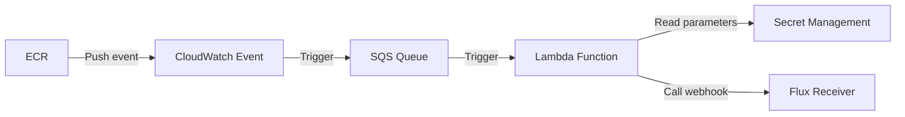

# flux2-ecr-webhook
This project allows you to automate the process of calling the Flux webhook (Receiver) when a `PUSH` action is performed in ECR, which can be useful for automating application deployment.
It is designed to be used as a Terraform module to configure an AWS Lambda function that fires when a `PUSH` action is performed on an ECR repository.
The Lambda function reads the necessary parameters from the SSM parameter store and then calls the Flux webhook ([Receiver](https://fluxcd.io/flux/components/notification/receiver/)).

The configuration includes creating an SQS queue and a CloudWatch event to trigger the Lambda function when a PUSH action is performed in ECR.



## TODO
- Add unit tests
- Add support for [generic-hmac](https://fluxcd.io/flux/components/notification/receiver/#generic-hmac)
- Add support to lambda with VPC (for internal webhook)

## Usage
To use this Terraform module, you must first have created webhooks for each [ImageRepository](https://fluxcd.io/flux/components/image/imagerepositories/) resource in your cluster.

For example, if you have an `ImageRepository` named `my-ecr-repo-ir`, you should create a [Receiver](https://fluxcd.io/flux/components/notification/receiver/) resource to create a webhook that can be called.
This webhook will then be used in our input variable named `repo_mapping`.
> **Note**: Only `generic` type receiver is supported.

```yaml
---
apiVersion: notification.toolkit.fluxcd.io/v1beta2
kind: Receiver
metadata:
  name: my-ecr-repo-receiver
  namespace: flux-system
spec:
  type: generic
  secretRef:
    name: webhook-token
  resources:
    - kind: ImageRepository
      name: my-ecr-repo-ir
```
The webhook created by the `Receiver` resource has to be configured in the module, for example:
> **Note**: Let's assume that our ECR repository is called `my-ecr-repo`.

```hcl
module "flux2-ecr-webhook" {
  source = "github.com/fabidick22/flux2-ecr-webhook?ref=v1.2.0"

  app_name = "flux-ecr-webhook"

  repo_mapping = {
    my-ecr-repo = {                                    # ECR resource name
      prod = {
        webhook = ["https://domain.com/hook/1111111"]  # URL created by the Receiver
        regex   = "prod-(?P<version>.*)"               # Regex for ECR image tag
      }
      stg = {
        webhook = ["https://domain.com/hook/2222222"]  # URL created by the Receiver
        regex   = "stg-(?P<version>.*)"                # Regex for ECR image tag
      }
    }
  }

  webhook_token = "var.webhook_token"
}
```
## Example
- [Complete](https://github.com/fabidick22/flux2-ecr-webhook/tree/main/examples/complete)

## Requirements

| Name | Version |
|------|---------|
| <a name="requirement_terraform"></a> [terraform](#requirement\_terraform) | >= 1.0 |
| <a name="requirement_aws"></a> [aws](#requirement\_aws) | >= 4.63 |

## Providers

| Name | Version |
|------|---------|
| <a name="provider_aws"></a> [aws](#provider\_aws) | >= 4.63 |

## Modules

| Name | Source | Version |
|------|--------|---------|
| <a name="module_lambda_function"></a> [lambda\_function](#module\_lambda\_function) | github.com/terraform-aws-modules/terraform-aws-lambda | v4.16.0 |
| <a name="module_sqs_queue"></a> [sqs\_queue](#module\_sqs\_queue) | github.com/terraform-aws-modules/terraform-aws-sqs | v4.0.1 |

## Resources

| Name | Type |
|------|------|
| [aws_cloudwatch_event_rule.ecr_event](https://registry.terraform.io/providers/hashicorp/aws/latest/docs/resources/cloudwatch_event_rule) | resource |
| [aws_cloudwatch_event_target.sqs_target](https://registry.terraform.io/providers/hashicorp/aws/latest/docs/resources/cloudwatch_event_target) | resource |
| [aws_iam_policy.lambda_secrets_policy](https://registry.terraform.io/providers/hashicorp/aws/latest/docs/resources/iam_policy) | resource |
| [aws_iam_policy.lambda_sqs_policy](https://registry.terraform.io/providers/hashicorp/aws/latest/docs/resources/iam_policy) | resource |
| [aws_iam_role_policy_attachment.lambda_secrets_attachment](https://registry.terraform.io/providers/hashicorp/aws/latest/docs/resources/iam_role_policy_attachment) | resource |
| [aws_iam_role_policy_attachment.lambda_sqs_attachment](https://registry.terraform.io/providers/hashicorp/aws/latest/docs/resources/iam_role_policy_attachment) | resource |
| [aws_lambda_event_source_mapping.sqs_mapping](https://registry.terraform.io/providers/hashicorp/aws/latest/docs/resources/lambda_event_source_mapping) | resource |
| [aws_secretsmanager_secret.repo-mapping](https://registry.terraform.io/providers/hashicorp/aws/latest/docs/resources/secretsmanager_secret) | resource |
| [aws_secretsmanager_secret.webhook-token](https://registry.terraform.io/providers/hashicorp/aws/latest/docs/resources/secretsmanager_secret) | resource |
| [aws_secretsmanager_secret_version.repo-mapping](https://registry.terraform.io/providers/hashicorp/aws/latest/docs/resources/secretsmanager_secret_version) | resource |
| [aws_secretsmanager_secret_version.webhook-token](https://registry.terraform.io/providers/hashicorp/aws/latest/docs/resources/secretsmanager_secret_version) | resource |
| [aws_sqs_queue_policy.sqs_policy](https://registry.terraform.io/providers/hashicorp/aws/latest/docs/resources/sqs_queue_policy) | resource |

## Inputs

| Name | Description | Type | Default | Required |
|------|-------------|------|---------|:--------:|
| <a name="input_app_name"></a> [app\_name](#input\_app\_name) | Name used for resources to create. | `string` | `"flux2-ecr-webhook"` | no |
| <a name="input_cw_logs_retention"></a> [cw\_logs\_retention](#input\_cw\_logs\_retention) | Specifies the number of days you want to retain log events in the specified log group. | `number` | `14` | no |
| <a name="input_repo_mapping"></a> [repo\_mapping](#input\_repo\_mapping) | Object with repository mapping, if this variable is set `repo_mapping_file` will be ignored.<br><br>**Available Attributes:**<br>- `<ECR>`: ECR resource name.<br>- `<ECR>.<ID>`: Unique name for webhooks.<br>- `<ECR>.<ID>.webhook`: Webhook list.<br>- `<ECR>.<ID>.token` (Optional): Token used for webhooks, if set, then "webhook\_token" will be ignored.<br>- `<ECR>.<ID>.regex` (Optional): Regular expression that is applied to the image tag | `any` | `null` | no |
| <a name="input_repo_mapping_file"></a> [repo\_mapping\_file](#input\_repo\_mapping\_file) | YAML file path with repository mapping. | `string` | `""` | no |
| <a name="input_webhook_token"></a> [webhook\_token](#input\_webhook\_token) | Webhook default token used to call the Flux receiver. If it doesn't find a `token` attribute in the repository mapping use this token for the webhooks | `string` | `null` | no |

## Outputs

No outputs.
