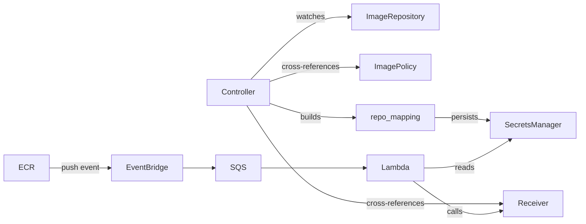

# flux2-ecr-webhook

Automates calling Flux webhooks ([Receivers](https://fluxcd.io/flux/components/notification/receiver/)) when ECR `PUSH` events occur.

## v2 — Kubernetes Controller (current)

A Kubernetes-native controller that **automatically discovers** Flux resources (ImageRepository, ImagePolicy, Receiver) and keeps the AWS infrastructure in sync — no manual `repo_mapping` configuration required.


```mermaid
graph LR
  C[Controller] -->|watches| IR[ImageRepository]
  C -->|cross-references| IP[ImagePolicy]
  C -->|cross-references| R[Receiver]
  C -->|builds| RM[repo_mapping]
  RM -->|persists| SM[SecretsManager]
  ECR -->|push event| EB[EventBridge]
  EB --> SQS --> Lambda
  Lambda -->|reads| SM
  Lambda -->|calls| R
```

### Install

```bash
helm install flux2-ecr-webhook ./helm/flux2-ecr-webhook \
  --namespace flux-system \
  --set flux.webhookBaseURL=https://flux.example.com \
  --set aws.region=us-east-1 \
  --set aws.irsaRoleArn=arn:aws:iam::123456789012:role/my-role
```

### How it works

1. The controller watches all `ImageRepository` resources in the cluster
2. For each one, it cross-references `Receiver` and `ImagePolicy` resources
3. It builds the `repo_mapping` structure automatically (webhook URLs, tokens, tag regex)
4. The mapping is persisted to AWS SecretsManager for the Lambda to consume

### Configuration

| Value | Description | Default |
|-------|-------------|---------|
| `flux.webhookBaseURL` | Base URL of the Flux notification-controller (required) | `""` |
| `flux.namespace` | Namespace where Flux is installed | `flux-system` |
| `scan.allNamespaces` | Scan all namespaces for ImageRepository resources | `true` |
| `scan.excludeNamespaces` | Namespaces to skip | `[kube-system, kube-public, kube-node-lease]` |
| `aws.region` | AWS region | `""` |
| `aws.irsaRoleArn` | IAM Role ARN for IRSA on EKS | `""` |
| `controller.resyncInterval` | Periodic resync interval | `5m` |
| `excludeAnnotation` | Annotation to exclude a repo | `ecr-webhook.io/skip` |

To exclude a specific ImageRepository:

```yaml
apiVersion: image.toolkit.fluxcd.io/v1beta2
kind: ImageRepository
metadata:
  name: my-repo
  annotations:
    ecr-webhook.io/skip: "true"
```

---

## v1 — Terraform Module (maintenance)

A Terraform module that configures an AWS Lambda to fire on ECR push events with manual `repo_mapping`.

> For v1 docs and usage, see the [`1.x` branch](https://github.com/fabidick22/flux2-ecr-webhook/tree/1.x).

```hcl
module "flux2-ecr-webhook" {
  source = "github.com/fabidick22/flux2-ecr-webhook?ref=v1.2.0"

  app_name = "flux-ecr-webhook"
  repo_mapping = {
    my-ecr-repo = {
      prod = {
        webhook = ["https://domain.com/hook/1111111"]
        regex   = "prod-(?P<version>.*)"
      }
    }
  }
  webhook_token = var.webhook_token
}
```
