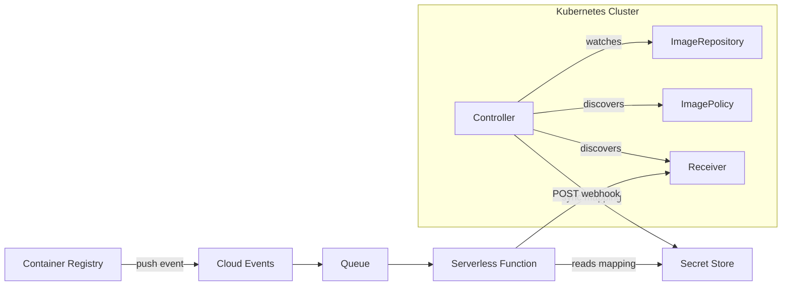
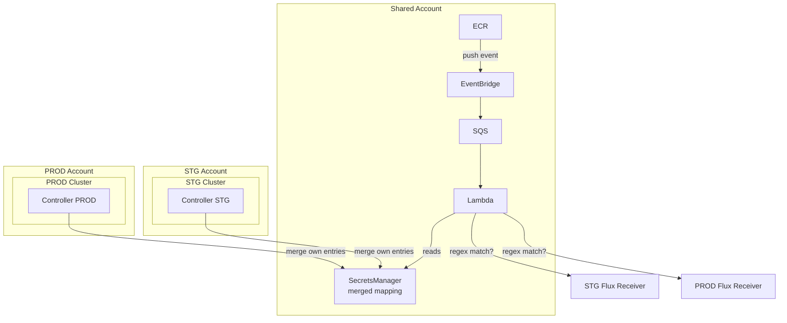

# flux2-ecr-webhook

Automates calling Flux webhooks ([Receivers](https://fluxcd.io/flux/components/notification/receiver/)) when container registry push events occur.

> Cloud-agnostic design ([CloudProvider interface](controller/internal/cloud/provider.go)). Currently implemented and tested on **AWS** (ECR + EventBridge + SQS + Lambda).

## How it works


```mermaid
graph LR
  subgraph Kubernetes Cluster
    C[Controller] -->|watches| IR[ImageRepository]
    C -->|discovers| IP[ImagePolicy]
    C -->|discovers| R[Receiver]
  end
  C -->|sync mapping| SS[Secret Store]
  REG[Container Registry] -->|push event| EV[Cloud Events]
  EV --> Q[Queue] --> FN[Serverless Function]
  FN -->|reads mapping| SS
  FN -->|POST webhook| R
```

> **AWS:** ECR → EventBridge → SQS → Lambda → SecretsManager

1. The controller watches all `ImageRepository` resources in the cluster
2. For each one, it cross-references `Receiver` and `ImagePolicy` resources
3. It builds the `repo_mapping` structure automatically (webhook URLs, tokens, tag regex)
4. The mapping is persisted to the cloud secret store for the serverless function to consume
5. On a registry push event, the function reads the mapping and calls the matching Flux webhooks

## Install

```bash
helm install flux2-ecr-webhook ./helm/flux2-ecr-webhook \
  --namespace flux-system \
  --set flux.webhookBaseURL=https://flux.example.com \
  --set aws.region=us-east-1 \
  --set aws.irsaRoleArn=arn:aws:iam::123456789012:role/my-role
```

## Configuration

| Value | Description | Default |
|-------|-------------|---------|
| `flux.webhookBaseURL` | Base URL of the Flux notification-controller (required) | `""` |
| `flux.namespace` | Namespace where Flux is installed | `flux-system` |
| `scan.allNamespaces` | Scan all namespaces for ImageRepository resources | `true` |
| `scan.excludeNamespaces` | Namespaces to skip | `[kube-system, kube-public, kube-node-lease]` |
| `aws.region` | AWS region | `""` |
| `aws.irsaRoleArn` | IAM Role ARN for IRSA on EKS | `""` |
| `aws.manageInfrastructure` | Create and manage cloud resources automatically | `true` |
| `aws.appName` | Prefix for cloud resource names (useful for isolation) | `flux2-ecr-webhook` |
| `controller.resyncInterval` | Periodic resync interval | `5m` |
| `excludeAnnotation` | Annotation to exclude a repo | `ecr-webhook.io/skip` |

## Deployment Modes

### Single Cluster (default)

One cluster, one set of cloud resources. No extra configuration needed.

```bash
helm install flux2-ecr-webhook ./helm/flux2-ecr-webhook \
  --namespace flux-system \
  --set flux.webhookBaseURL=https://flux.example.com \
  --set aws.region=us-east-1 \
  --set aws.irsaRoleArn=arn:aws:iam::123456789012:role/my-role
```

### Multi-Cluster (shared cloud account)

Multiple clusters sharing the same cloud account and resources. Each controller automatically identifies itself using the `webhookBaseURL` hostname — no extra configuration required.


```mermaid
graph TB
  subgraph STG Account
    subgraph STG Cluster
      C1[Controller STG]
    end
  end
  subgraph PROD Account
    subgraph PROD Cluster
      C2[Controller PROD]
    end
  end
  subgraph Shared Account
    ECR -->|push event| EB[EventBridge]
    EB --> SQS --> Lambda
    SS[SecretsManager<br/>merged mapping]
    Lambda -->|reads| SS
  end
  C1 -->|merge own entries| SS
  C2 -->|merge own entries| SS
  Lambda -->|regex match?| W1[STG Flux Receiver]
  Lambda -->|regex match?| W2[PROD Flux Receiver]
```

> Example uses AWS terminology. The concept applies to any supported cloud provider (GCP projects, Azure subscriptions, etc.).

Each controller uses a **read → merge → write** cycle so entries from other clusters are preserved. The mapping keys are automatically prefixed with the cluster identity:

```json
{
  "my-app": {
    "flux.stg.example.com::my-app-receiver": {
      "webhook": ["https://flux.stg.example.com/hook/abc123"],
      "token": "stg-token",
      "regex": "^stg-.*"
    },
    "flux.prod.example.com::my-app-receiver": {
      "webhook": ["https://flux.prod.example.com/hook/xyz789"],
      "token": "prod-token",
      "regex": "^prod-.*"
    }
  }
}
```

Install on each cluster — only `webhookBaseURL` and `irsaRoleArn` differ:

```bash
# STG cluster
helm install flux2-ecr-webhook ./helm/flux2-ecr-webhook \
  --namespace flux-system \
  --set flux.webhookBaseURL=https://flux.stg.example.com \
  --set aws.region=us-east-1 \
  --set aws.irsaRoleArn=arn:aws:iam::123456789012:role/stg-role

# PROD cluster
helm install flux2-ecr-webhook ./helm/flux2-ecr-webhook \
  --namespace flux-system \
  --set flux.webhookBaseURL=https://flux.prod.example.com \
  --set aws.region=us-east-1 \
  --set aws.irsaRoleArn=arn:aws:iam::123456789012:role/prod-role
```

If you ever reach the secret size limit (64 KB, unlikely for most setups), use `aws.appName` to create a separate set of cloud resources for additional clusters.

### External Infrastructure

Set `aws.manageInfrastructure=false` when you manage cloud resources externally (Terraform, CDK, etc.). The controller will only sync the mapping and event filters.

```bash
helm install flux2-ecr-webhook ./helm/flux2-ecr-webhook \
  --namespace flux-system \
  --set flux.webhookBaseURL=https://flux.example.com \
  --set aws.region=us-east-1 \
  --set aws.manageInfrastructure=false \
  --set aws.irsaRoleArn=arn:aws:iam::123456789012:role/my-role
```

## Exclude a Repository

Add the exclusion annotation to skip a specific ImageRepository:

```yaml
apiVersion: image.toolkit.fluxcd.io/v1beta2
kind: ImageRepository
metadata:
  name: my-repo
  annotations:
    ecr-webhook.io/skip: "true"
```

## Cloud Provider Support

| Provider | Status |
|----------|--------|
| AWS (ECR) | Implemented and tested |
| GCP (Artifact Registry) | Planned |
| Azure (ACR) | Planned |

---

## v1 — Terraform Module (maintenance)

A Terraform module that configures an AWS Lambda to fire on ECR push events with manual `repo_mapping`.

> For v1 docs and usage, see the [`1.x` branch](https://github.com/fabidick22/flux2-ecr-webhook/tree/1.x).

```hcl
module "flux2-ecr-webhook" {
  source = "github.com/fabidick22/flux2-ecr-webhook?ref=v1.2.0"

  app_name = "flux-ecr-webhook"
  repo_mapping = {
    my-ecr-repo = {
      prod = {
        webhook = ["https://domain.com/hook/1111111"]
        regex   = "prod-(?P<version>.*)"
      }
    }
  }
  webhook_token = var.webhook_token
}
```
