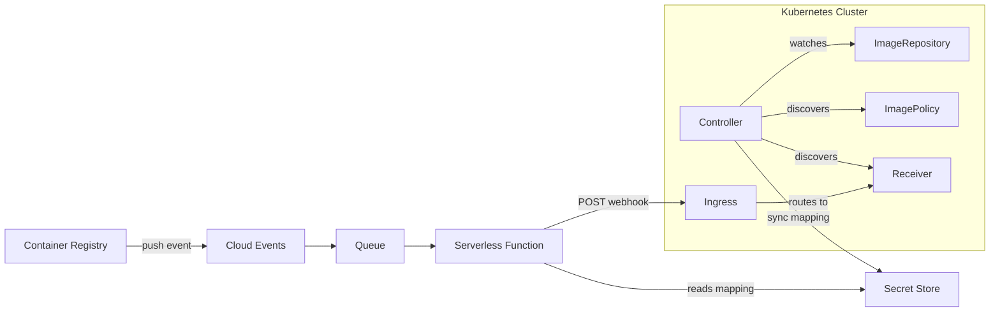
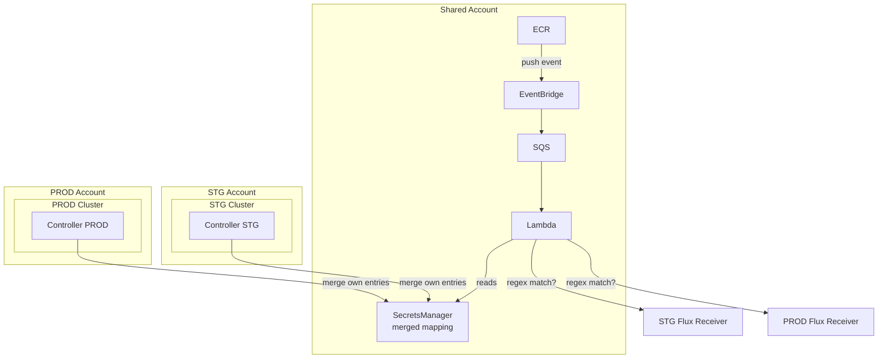

# flux2-ecr-webhook

A Kubernetes controller that triggers [Flux CD](https://fluxcd.io/) reconciliation in seconds after a container image push, instead of waiting for the default polling interval. It automatically discovers Flux resources ([ImageRepository](https://fluxcd.io/flux/components/image/imagerepositories/), [ImagePolicy](https://fluxcd.io/flux/components/image/imagepolicies/), [Receivers](https://fluxcd.io/flux/components/notification/receiver/)) and wires cloud-native push events to Flux webhooks — no manual mapping or Terraform required.

> Cloud-agnostic design ([CloudProvider interface](controller/internal/cloud/provider.go)). Currently implemented and tested on **AWS** (ECR + EventBridge + SQS + Lambda).

## How it works


```mermaid
graph LR
  subgraph Kubernetes Cluster
    C[Controller] -->|watches| IR[ImageRepository]
    C -->|discovers| IP[ImagePolicy]
    C -->|discovers| R[Receiver]
    ING[Ingress] -->|routes to| R
  end
  C -->|sync mapping| SS[Secret Store]
  REG[Container Registry] -->|push event| EV[Cloud Events]
  EV --> Q[Queue] --> FN[Serverless Function]
  FN -->|reads mapping| SS
  FN -->|POST webhook| ING
```

> **AWS:** ECR → EventBridge → SQS → Lambda → SecretsManager

1. The controller watches all `ImageRepository` resources in the cluster
2. For each one, it cross-references `Receiver` and `ImagePolicy` resources
3. It builds the `repo_mapping` structure automatically (webhook URLs, tokens, tag regex)
4. The mapping is persisted to the cloud secret store for the serverless function to consume
5. On a registry push event, the function reads the mapping and calls the matching Flux webhooks

## Install

```bash
helm install flux2-ecr-webhook ./helm/flux2-ecr-webhook \
  --namespace flux-system \
  --set flux.webhookBaseURL=https://flux.example.com \
  --set aws.region=us-east-1 \
  --set aws.irsaRoleArn=arn:aws:iam::123456789012:role/my-role
```

## Configuration

| Value | Description | Default |
|-------|-------------|---------|
| `flux.webhookBaseURL` | Base URL of the Flux notification-controller (required) | `""` |
| `flux.namespace` | Namespace where Flux is installed | `flux-system` |
| `scan.allNamespaces` | Scan all namespaces for ImageRepository resources | `true` |
| `scan.excludeNamespaces` | Namespaces to skip | `[kube-system, kube-public, kube-node-lease]` |
| `aws.region` | AWS region | `""` |
| `aws.irsaRoleArn` | IAM Role ARN for IRSA on EKS | `""` |
| `aws.manageInfrastructure` | Create and manage cloud resources automatically | `true` |
| `aws.appName` | Prefix for cloud resource names (useful for isolation) | `flux2-ecr-webhook` |
| `controller.resyncInterval` | Periodic resync interval | `5m` |
| `excludeAnnotation` | Annotation to exclude a repo | `ecr-webhook.io/skip` |

## Deployment Modes

### Single Cluster (default)

One cluster, one set of cloud resources. No extra configuration needed.

```bash
helm install flux2-ecr-webhook ./helm/flux2-ecr-webhook \
  --namespace flux-system \
  --set flux.webhookBaseURL=https://flux.example.com \
  --set aws.region=us-east-1 \
  --set aws.irsaRoleArn=arn:aws:iam::123456789012:role/my-role
```

### Multi-Cluster (shared cloud account)

All clusters share **one set of AWS resources** (SQS, Lambda, EventBridge, SecretsManager) and **one SecretsManager secret** where each controller merges its own entries using a read → merge → write cycle. The `webhookBaseURL` hostname is used as the cluster identity to avoid key collisions.

Key points:
- **One cluster** must set `manageInfrastructure: true` to create the shared AWS resources (SQS, Lambda, EventBridge, etc.)
- **All other clusters** must set `manageInfrastructure: false` to avoid conflicts with existing resources
- All clusters must use the same `appName` so they discover and share the same resources


```mermaid
graph TB
  subgraph STG Account
    subgraph STG Cluster
      C1[Controller STG]
    end
  end
  subgraph PROD Account
    subgraph PROD Cluster
      C2[Controller PROD]
    end
  end
  subgraph Shared Account
    ECR -->|push event| EB[EventBridge]
    EB --> SQS --> Lambda
    SS[SecretsManager<br/>merged mapping]
    Lambda -->|reads| SS
  end
  C1 -->|merge own entries| SS
  C2 -->|merge own entries| SS
  Lambda -->|regex match?| W1[STG Flux Receiver]
  Lambda -->|regex match?| W2[PROD Flux Receiver]
```

#### Helm values examples

Cluster that owns the infrastructure (`manageInfrastructure: true`):

```yaml
# shared-cluster — creates and manages the AWS resources
flux:
  webhookBaseURL: https://gitops.shared-account.com
  namespace: flux-system

aws:
  region: us-east-1
  appName: flux-webhook
  manageInfrastructure: true

serviceAccount:
  annotations:
    eks.amazonaws.com/role-arn: arn:aws:iam::111111111111:role/flux-webhook-controller-role
```

Clusters that only sync their mappings (`manageInfrastructure: false`):

```yaml
# cluster-one — only syncs mapping, does not create AWS resources
flux:
  webhookBaseURL: https://gitops.account-one.com
  namespace: flux-system

aws:
  region: us-east-1
  appName: flux-webhook
  manageInfrastructure: false

serviceAccount:
  annotations:
    eks.amazonaws.com/role-arn: arn:aws:iam::111111111111:role/flux-webhook-controller-role
```

```yaml
# cluster-two — only syncs mapping, does not create AWS resources
flux:
  webhookBaseURL: https://gitops.account-two.com
  namespace: flux-system

aws:
  region: us-east-1
  appName: flux-webhook
  manageInfrastructure: false

serviceAccount:
  annotations:
    eks.amazonaws.com/role-arn: arn:aws:iam::111111111111:role/flux-webhook-controller-role
```

The resulting SecretsManager mapping merges entries from all clusters:

```json
{
  "my-app": {
    "gitops.shared-account.com::my-app-receiver": {
      "webhook": ["https://gitops.shared-account.com/hook/abc123"],
      "token": "shared-token",
      "regex": "^main-.*"
    },
    "gitops.account-one.com::my-app-receiver": {
      "webhook": ["https://gitops.account-one.com/hook/def456"],
      "token": "one-token",
      "regex": "^stg-.*"
    }
  }
}
```

### External Infrastructure

Set `aws.manageInfrastructure=false` when you manage cloud resources externally (Terraform, CDK, etc.). The controller will only sync the mapping and event filters.

```bash
helm install flux2-ecr-webhook ./helm/flux2-ecr-webhook \
  --namespace flux-system \
  --set flux.webhookBaseURL=https://flux.example.com \
  --set aws.region=us-east-1 \
  --set aws.manageInfrastructure=false \
  --set aws.irsaRoleArn=arn:aws:iam::123456789012:role/my-role
```

## AWS IAM Setup

The controller needs an IAM role with permissions to manage Lambda, SQS, EventBridge, SecretsManager, IAM, and CloudWatch Logs. See the full policy example at [`examples/aws/iam-policy.json`](examples/aws/iam-policy.json).

> Replace `<REGION>` and `<ACCOUNT_ID>` with your values.

### Option 1: Same Account

Create an IAM role in the same account where the EKS cluster runs. Attach the policy and configure an OIDC trust relationship for IRSA pointing to the cluster's service account (`flux-system:flux2-ecr-webhook`).

### Option 2: Cross-Account (shared account)

When the cluster runs in one account (e.g. STG) but the cloud resources live in a **shared account**:

1. Create an [OIDC Identity Provider](https://docs.aws.amazon.com/IAM/latest/UserGuide/id_roles_providers_create_oidc.html) in the **shared account** using the EKS OIDC issuer URL from the cluster account
2. Create the IAM role in the **shared account** with the policy and an OIDC trust relationship pointing to the identity provider created in step 1
3. Use the shared account role ARN in `aws.irsaRoleArn`

The pod assumes the role directly in the shared account via OIDC federation. Repeat for each cluster that needs access.

## Exclude a Repository

Add the exclusion annotation to skip a specific ImageRepository:

```yaml
apiVersion: image.toolkit.fluxcd.io/v1beta2
kind: ImageRepository
metadata:
  name: my-repo
  annotations:
    ecr-webhook.io/skip: "true"
```

## Cloud Provider Support

| Provider | Status |
|----------|--------|
| AWS (ECR) | Implemented and tested |
| GCP (Artifact Registry) | Planned |
| Azure (ACR) | Planned |

---

## v1 — Terraform Module (maintenance)

A Terraform module that configures an AWS Lambda to fire on ECR push events with manual `repo_mapping`.

> For v1 docs and usage, see the [`1.x` branch](https://github.com/fabidick22/flux2-ecr-webhook/tree/1.x).

```hcl
module "flux2-ecr-webhook" {
  source = "github.com/fabidick22/flux2-ecr-webhook?ref=v1.2.0"

  app_name = "flux-ecr-webhook"
  repo_mapping = {
    my-ecr-repo = {
      prod = {
        webhook = ["https://domain.com/hook/1111111"]
        regex   = "prod-(?P<version>.*)"
      }
    }
  }
  webhook_token = var.webhook_token
}
```
