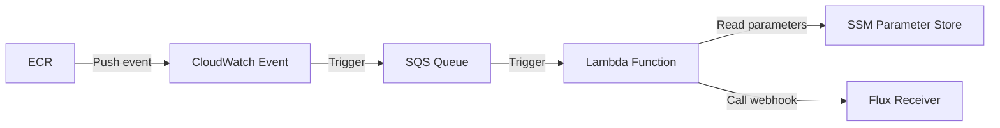

# flux2-ecr-webhook
This project allows you to automate the process of calling the Flux webhook (Receiver) when a `PUSH` action is performed in ECR, which can be useful for automating application deployment. 
It is designed to be used as a Terraform module to configure an AWS Lambda function that fires when a `PUSH` action is performed on an ECR repository. 
The Lambda function reads the necessary parameters from the SSM parameter store and then calls the Flux webhook ([Receiver](https://fluxcd.io/flux/components/notification/receiver/)).

The configuration includes creating an SQS queue and a CloudWatch event to trigger the Lambda function when a PUSH action is performed in ECR.

## TODO
- Add unit tests
- Add support for [generic-hmac](https://fluxcd.io/flux/components/notification/receiver/#generic-hmac)
- Add support to lambda with VPC (for internal webhook)
- Add support to multiple webhooks
