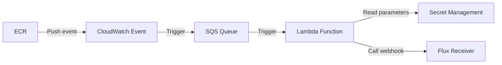

# flux2-ecr-webhook
This project allows you to automate the process of calling the Flux webhook (Receiver) when a `PUSH` action is performed in ECR, which can be useful for automating application deployment. 
It is designed to be used as a Terraform module to configure an AWS Lambda function that fires when a `PUSH` action is performed on an ECR repository. 
The Lambda function reads the necessary parameters from the SSM parameter store and then calls the Flux webhook ([Receiver](https://fluxcd.io/flux/components/notification/receiver/)).

The configuration includes creating an SQS queue and a CloudWatch event to trigger the Lambda function when a PUSH action is performed in ECR.



## TODO
- Add unit tests
- Add support for [generic-hmac](https://fluxcd.io/flux/components/notification/receiver/#generic-hmac)
- Add support to lambda with VPC (for internal webhook)
- Add support to multiple webhooks

## Usage
To use this Terraform module, you must first have created webhooks for each [ImageRepository](https://fluxcd.io/flux/components/image/imagerepositories/) resource in your cluster. 

For example, if you have an `ImageRepository` named `my-ecr-repo-ir`, you should create a [Receiver](https://fluxcd.io/flux/components/notification/receiver/) resource to create a webhook that can be called. 
This webhook will then be used in our input variable named `repo_mapping`.
> **Note**: Only `generic` type receiver is supported.

```yaml
---
apiVersion: notification.toolkit.fluxcd.io/v1beta2
kind: Receiver
metadata:
  name: my-ecr-repo-receiver
  namespace: flux-system
spec:
  type: generic
  secretRef:
    name: webhook-token
  resources:
    - kind: ImageRepository
      name: my-ecr-repo-ir
```
The webhook created by the `Receiver` resource has to be configured in the module, for example:
```hcl
module "flux2-ecr-webhook" {
  source = "github.com/fabidick22/flux2-ecr-webhook?ref=v1.0.2"

  ...
  repo_mapping = {
    my-ecr-repo = {
      webhook = "https://custom.domain.com/hook/11111111"
    }
  }
  ...
}
```
## Example
- [Complete](https://github.com/fabidick22/flux2-ecr-webhook/tree/main/examples/complete)